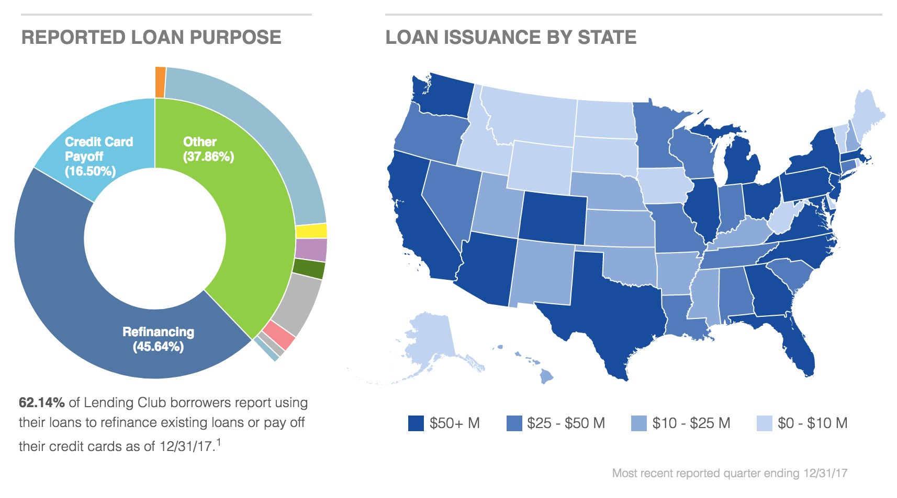
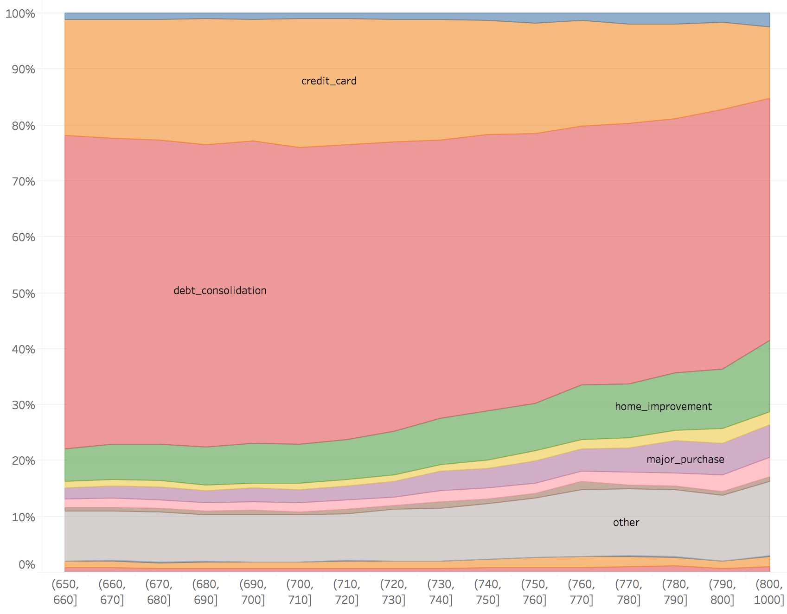
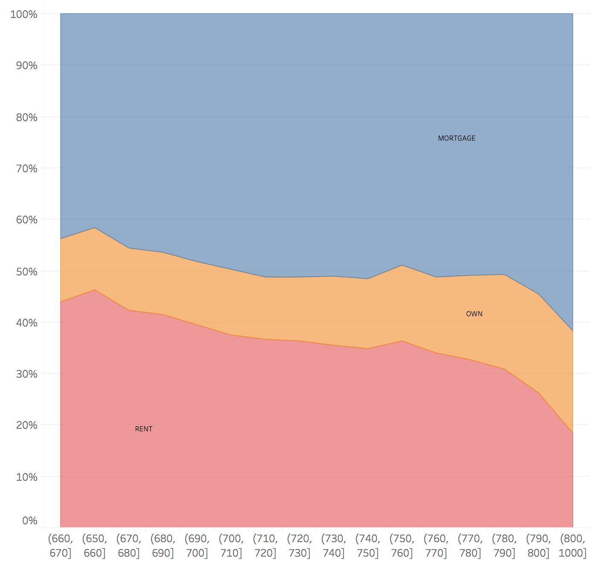
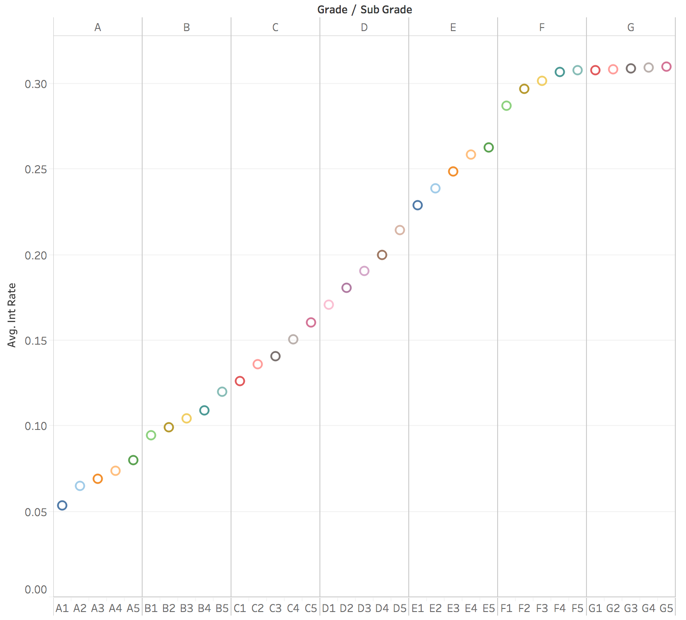
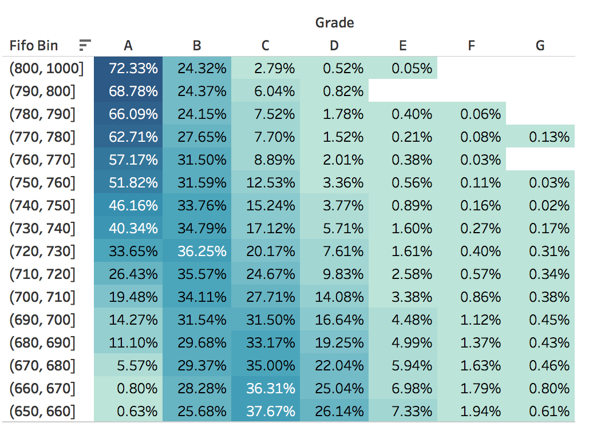
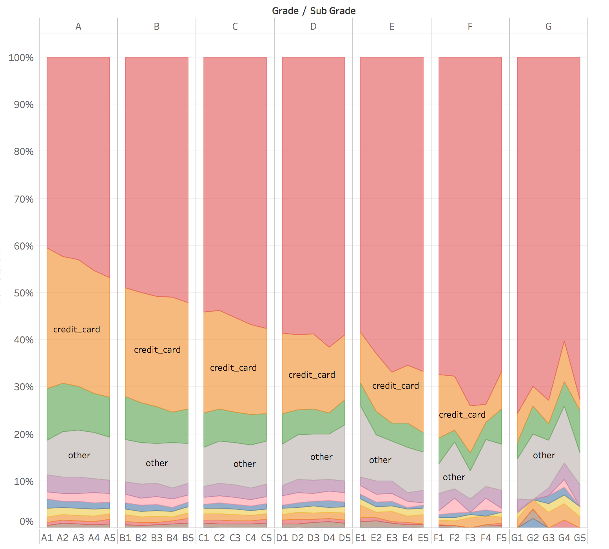
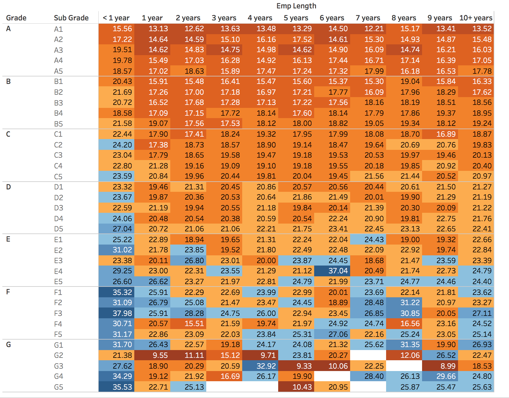
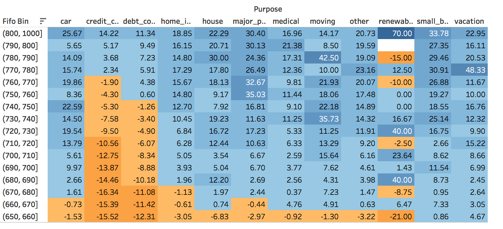

# Lending Club Exploratory Analysis 

## 1.0 Perspective

Individual loans have always been used to predict whether a certain loan will default and then calculate the **default rate**. According to the exposure, people can use all these data to estimate the final net loss. Moreover, people can estimate certain losses under different scenarios - stress testing. This is a typical perspective from risk management - internal perspective.

**However**, one unique perspective is from competitor’s perspective. As major competitors of  Lending club, banks have natural advantages like security. As a consequence, I come up with the first question. 

## 2.0 Start From A Question

**Why people choose Lending Club rather than large banks when they apply for personal loans?**

[**Figure 1**] (https://www.lendingclub.com/info/statistics.action) : Data Overview

From Lending Club Official Website

Considering low-interest rate and loan purposes in Figure 1.0, I guess different  customer clusters may have different objectives:

- High Credit Score Applicants: Use low-interest rate to **refinance** current loan or debt - debt consolidation. 
- Low Credit Score Applicants: Achieve short-term **consumption** objective or pay old loans (short-term liquidity).

High credit score applicants have good credit records and are willing to reduce current finance cost. Low credit score applicants generally have bad credit records and want to solve current liquidity problem.

### Objective :
Find insights about whether high credit score applicants do not choose large banks.

## 3.0 Data Explore

- Data Source: https://www.lendingclub.com/info/download-data.action 
- Time Period: 2017 Quarter 4
- Priority: High Score Applicants 

### 3.1 Home Improvement and Ownership

At first, I segment the whole dataset based on FICO score to test my original thought and better understand current data. FICO scores are split into intervals  (width 10).

**Figure 2**: FICO Bin's Purpose

From Figure 2, my initial guess is only partly correct. Although debt consolidation indeed is the main reason for borrowing, high score applicants concern more about home improvement. 

As a result, I check home ownership of each FICO bin using similar methods.

**Figure 3**: FICO Bin's House Ownership

#### New Guess :

High score applicants with mortgage loans want to improve their house. However, mortgage loans actually affect applicants' evaluating "scores". For example, people with mortgage loans may have a high debt to income ratio. So, these factors set barriers for these applicants.  

### 3.2 Debt Consolidation 

High score applicants who want to consolidate their debt are very sensitive to interest rate. So, I first do research on what actually influence the interest rate.

**Figure 4**: Interest Rate For Each Grade

According to the Lending Club's prospectus, applicants will receive the pre-defined loan term and interest rate after Lending Club assessing their credit situation, and then pick up one. That is to say, even if applicants want to refinance their previous debts, this interest rate also should be lowered than the interest rate of previous debt.

From Figure 4, each loan's interest rate is determined by final grade evaluated by Lending Club. So, Grade is very important if we want to figure out the refinancing problem. Moreover, research about grading algorithm actually helps us understand Lending Club's business model.

### 3.3 Advanced Exploration About Grade

Driven by previous research, I check the relationship between FICO score and grade. From Figure 5, not all high FICO score applicant's loan can be graded by high loan grade.

**Figure 5**: FICO Bin and Grade

 

To figure out more factors affecting grades, I check other variables. In Figure 6, different loan purpose may affect final grading, especially for different FIFO groups.  

**Figure 6** : Grade Bin and Purchase
 

**Figure 7** : Debt to Income 
 

Besides loan purpose, I also check debt to income ratio. To get a more accurate result, I control the employment rate. Because people will long work experience may be in high-level positions.

With all these findings, we can further discover how the grades have been assigned using machine learning techniques like boosting trees (XGBoost). However, in this document, I care more about which factors will affect final loan grade. 

### 4.0 Brief Summary

This document mainly analyzes how can banks do better to expand their customer base. If we have an assumption here, all people go to Lending Club have been denied by other large banks. Then, Lending Club should have very high default rate. 

In reality, Lending Club indeed has a higher default. However, after considering their applicants, I think large banks have some wrong estimation about their clients when they decide whether they should approve a loan.

** First: Applicant with Mortgage want to Improve its house**

Clients with mortgage loans have a natural desire to improve their house's situations. Banks can have an investigation about this. Also, this action will increase the current value of the house. Research on this will help banks improve its loan size without increasing current cost.

- Reconsider Applications concerning house improvement and house

**Second: More Research about how Lending Club assigns loan grade**

Even though this is only a feasible analysis, the further model part will help us find the most essential factor for loan grade. Refinancing problem is caused by the interest rate. People's FICO, income and other factors will change with time (See Figure 8). But all loans are determined in the past time. Actually, this is the root problem. Research on grade/interest rate determination pattern will provide some protection for current portfolios and future cash flow.

- Find Protecting strategies from interest rate determine factors.

**Figure 8** : FICO score change

 
